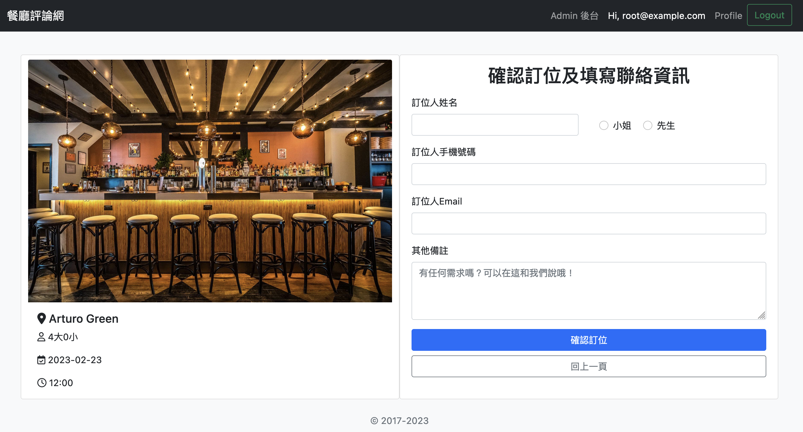
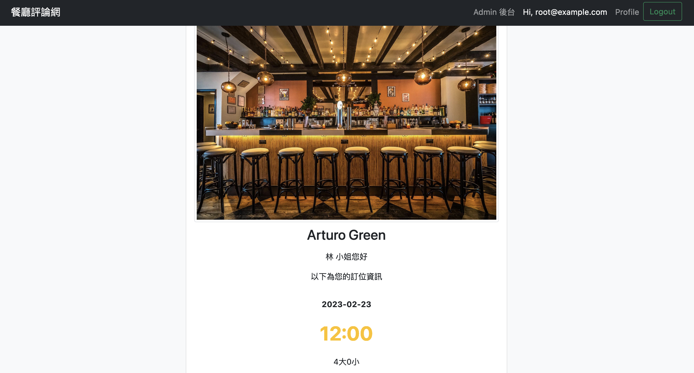

# Restaurant reservation forum

Restaurant reservation forum bulit with Node.js and MySQL for searching restauransts, leaving comments and making reservation with an account 

## Table of contents

- [Overview](#Overview)
- [Screenshot](#Screenshot)
- [Installation](#Installation)
- [Built with](#built-with)
- [Author](#author)

## Overview
- Login or logout with account
- login with Facebook or Googel
- Searching time or restaurants you want to reserve
- Making reservation and after that it will mail you 
- Admin can create new restaurants, add or edit avaliable time for booking and manage account permission


## Screenshot





## Installation

1. Open your terminal and use 'git clone' to copy this project to local.

```
git clone https://github.com/qweb321/forum-express-grading/tree/feature
```
2. Install all dependencies.
```
 npm install
 ```
3. Run all migrations and seeders.
```
npx sequelize db:migrate
npx sequelize db:seed:all
```
4. After installation finished, create an `.env` file to past all code from `.env.example` file

5. After creating database done, run

```
npm run start
```

6. If terminal show the sentence below, means run successfully and click the url

```
app is listening in http://localhost:3000
```

7. If you want to stop

```
ctrl + C
```

8. Test Account

 
* admin 
  * email: root@example.com
  * password: 12345678
* user：
  * email: user1@example.com
  * password: 12345678
  ## Built with

- Node.js
- Express
- Express-Handlebars
- Javascript
- Dotenv
- Mongoose
- Passport
- Bootstrap
